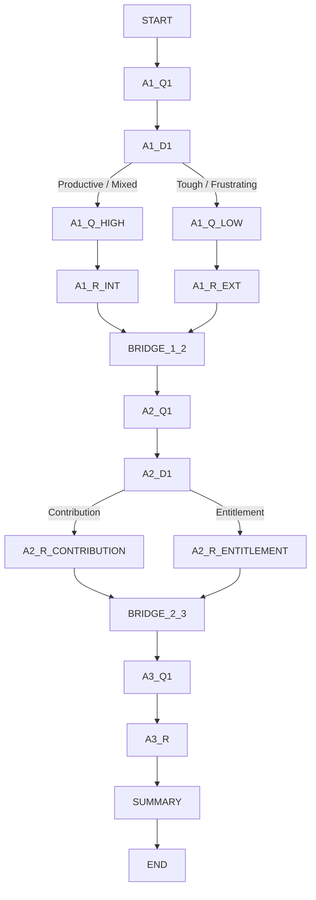

# Reflection Tree Diagram

```mermaid
graph TD

START --> A1_Q1

A1_Q1 --> A1_D1

A1_D1 -->|Productive / Mixed| A1_Q_HIGH
A1_D1 -->|Tough / Frustrating| A1_Q_LOW

A1_Q_HIGH --> A1_R_INT
A1_Q_LOW --> A1_R_EXT

A1_R_INT --> BRIDGE_1_2
A1_R_EXT --> BRIDGE_1_2

BRIDGE_1_2 --> A2_Q1

A2_Q1 --> A2_D1

A2_D1 -->|Contribution| A2_R_CONTRIBUTION
A2_D1 -->|Entitlement| A2_R_ENTITLEMENT

A2_R_CONTRIBUTION --> BRIDGE_2_3
A2_R_ENTITLEMENT --> BRIDGE_2_3

BRIDGE_2_3 --> A3_Q1

A3_Q1 --> A3_R

A3_R --> SUMMARY

SUMMARY --> END
```
